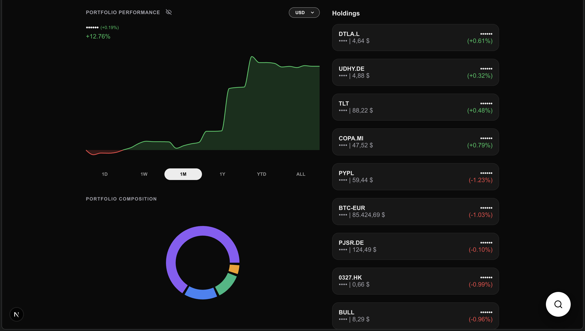

# Portfolio Tracker



A premium, dark-mode portfolio tracker built with Next.js, Recharts, and Yahoo Finance. Track your investments across stocks, cryptocurrencies, and forex with real-time data, advanced analytics, and a beautiful user interface.

## ✨ Features

### Core Functionality
- **Live Market Data**: Real-time prices and performance metrics via Yahoo Finance API
- **Multi-Portfolio Support**: Create and manage multiple portfolios with independent tracking
- **Multi-Currency Support**: Track assets in USD, EUR, AUD and other currencies with automatic FX conversion using USD-pivot strategy
- **Transaction Management**: Full buy/sell history with detailed P/L tracking per transaction
- **Transaction Notes**: Add optional notes to any transaction for better record keeping
- **Deposits & Withdrawals**: Track fiat currency movements in and out of your portfolios
- **Privacy Mode**: Toggle to hide sensitive balance information
- **CSV Import/Export**: Seamlessly import and export portfolio data with automatic portfolio detection

### Visual Analytics
- **Interactive Performance Charts**: 
  - Main portfolio chart with customizable timeframes (1D, 1W, 1M, 3M, 1Y, YTD, ALL)
  - Split-color gradients (green for gains, red for losses)
  - Asset-specific historical charts with FX-adjusted pricing
  - Intelligent resampling for smooth weekly charts
- **Composition Chart**: Visual breakdown of portfolio allocation by asset
- **Profit Chart**: Track your gains and losses over time
- **Per-Transaction P/L**: See profit/loss for each individual buy transaction

### Performance & Reliability
- **Smart Caching**: Timeframe-aware caching reduces API calls (5min for intraday, 30min for weekly, 1hr for longer periods)
- **Robust FX Handling**: USD-pivot FX conversion strategy ensures accurate cross-currency calculations
- **Outlier Detection**: Statistical smoothing catches data anomalies without affecting real market movements

### Advanced UI/UX
- **Premium Dark Mode**: Carefully crafted glassmorphic design with smooth animations
- **Loading Skeletons**: Polished loading states for all components
- **Responsive Design**: Optimized for desktop and mobile devices
- **Atomic State Updates**: Optimized rendering prevents UI flicker during data updates
- **Settings Panel**: Centralized settings with data management, portfolio controls, and import/export

## 🚀 Getting Started

### Prerequisites

- Node.js 18.x or later
- npm or yarn

### Installation

1. Clone the repository:
   ```bash
   git clone https://github.com/Rovart/portfolio-tracker.git
   cd portfolio-tracker
   ```

2. Install dependencies:
   ```bash
   npm install
   ```

3. Build the production application:
   ```bash
   npm run build
   ```

4. Start the production server:
   ```bash
   npm run start
   ```

5. Open [http://localhost:3000](http://localhost:3000) in your browser.

## 📊 Usage

### Managing Portfolios
1. Click the settings icon (gear) to open the Settings panel
2. Create new portfolios with the "+" button
3. Switch between portfolios using the dropdown in the header
4. View "All Portfolios" for a combined view across all portfolios

### Adding Assets
1. Click the "Add Asset" button
2. Search for stocks (e.g., AAPL), cryptocurrencies (e.g., BTC-USD), or forex pairs
3. Enter transaction details (amount, price, date)
4. Add optional notes to document the transaction
5. Save to add to your portfolio

### Managing Transactions
- View all transactions for an asset by clicking on it in the holdings list
- Edit or delete individual transactions
- Track P/L for each buy transaction with current vs. purchase price comparison
- Add deposits/withdrawals for fiat currencies

### Import/Export
- Export your portfolio to CSV via Settings > Data Management
- Import CSV files with automatic portfolio name detection
- Choose to merge into existing portfolio or create new when importing

### Customization
- Switch between USD, EUR, AUD and other base currencies
- Toggle privacy mode to hide balances
- Adjust chart timeframes for different perspectives

## 🗂️ Data Persistence

Transactions are saved locally in your browser's `localStorage` and can be exported to CSV for backup or migration. Each portfolio maintains its own transaction history.

## 🛠️ Tech Stack

- **Frontend**: Next.js 15, React 19
- **Charts**: Recharts
- **Styling**: Vanilla CSS with custom design system
- **Data Source**: Yahoo Finance API
- **Icons**: Lucide React

## 📝 License

This project is licensed under the **GNU General Public License v3.0 (GPL-3.0)**.

This means:
- ✅ You can freely use, modify, and distribute this software
- ✅ You can use it for commercial purposes
- ⚠️ Any derivative work must also be open source under GPL-3.0
- ⚠️ You must disclose the source code of any modifications

See the [LICENSE](LICENSE) file for full details.

## 🤝 Contributing

Contributions are welcome! Please feel free to submit a Pull Request.

## 🙏 Acknowledgments

- Market data provided by Yahoo Finance
- Built with modern web technologies and best practices
- Inspired by the need for a clean, privacy-focused portfolio tracker

---

**Note**: This application uses public Yahoo Finance APIs. For production use, ensure compliance with their terms of service and consider implementing rate limiting.
