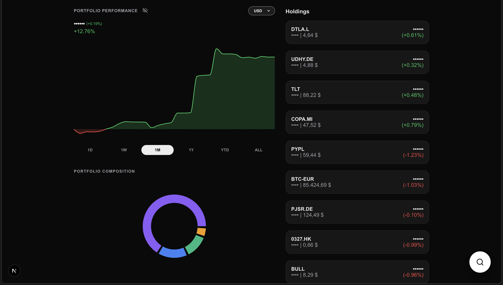

# Portfolio Tracker



A premium, dark-mode portfolio tracker built with Next.js, Recharts, and Yahoo Finance. Track your investments across stocks, cryptocurrencies, and forex with real-time data, advanced analytics, and a beautiful user interface.

## ✨ Features

### Core Functionality
- **Live Market Data**: Real-time prices and performance metrics via Yahoo Finance API
- **Multi-Portfolio Support**: Create and manage multiple portfolios with independent tracking
- **Multi-Currency Support**: Track assets in USD, EUR, AUD and other currencies with automatic FX conversion using USD-pivot strategy
- **Transaction Management**: Full buy/sell history with detailed P/L tracking per transaction
- **Transaction Notes**: Add optional notes to any transaction for better record keeping
- **Deposits & Withdrawals**: Track fiat currency movements in and out of your portfolios
- **Privacy Mode**: Toggle to hide sensitive balance information
- **CSV Import/Export**: Transfers transactions with complete timestamps, deterministic FIFO ordering, cost basis and multiline notes
- **Complete Backups**: Export and restore portfolios, transactions, watchlists, public wallet addresses and preferences as a versioned JSON file. Restore validates the file and previews its contents before replacing local data.

### Visual Analytics
- **Interactive Performance Charts**: 
  - Main portfolio chart with customizable timeframes (1D, 1W, 1M, 3M, 1Y, YTD, ALL)
  - Split-color gradients (green for gains, red for losses)
  - Asset-specific historical charts with FX-adjusted pricing
  - Buy/sell markers match execution prices at the latest crossing of the displayed curve; when there is no crossing, they stay on the nearest curve point and retain the actual execution price in their details
  - Intelligent resampling for smooth weekly charts
- **Composition Chart**: Visual breakdown of portfolio allocation by asset
- **Profit Chart**: Track your gains and losses over time
- **Per-Transaction P/L**: See profit/loss for each individual buy transaction

### Performance & Reliability
- **Smart Caching**: Timeframe-aware caching reduces API calls (15min for intraday, 30min for weekly, 1hr for longer periods)
- **Shared History Requests**: Asset and FX views reuse pending requests, while chart sampling preserves peaks and troughs within a 300-point rendering budget
- **Robust FX Handling**: USD-pivot FX conversion strategy ensures accurate cross-currency calculations
- **Original Market Prices**: Historical charts retain valid provider prices, including spikes; no statistical smoothing rewrites prices
- **Unavailable Prices**: Missing quotes or FX rates show an unavailable price and a partial portfolio value rather than a fabricated loss
- **Quote Timestamps**: Asset rows and details show the market quote time (or retrieval time when the provider omits it), with a saved-data label during outages
- **Refresh & App Activity**: Pull-to-refresh invalidates history freshness; returning to the app or reconnecting refreshes immediately. Recurring market queries pause in the background. Per-symbol saved quotes survive changes to portfolio batches.

### Advanced UI/UX
- **Premium Dark Mode**: Carefully crafted glassmorphic design with smooth animations
- **Loading Skeletons**: Polished loading states for all components
- **Responsive Design**: Optimized for desktop and mobile devices
- **Atomic State Updates**: Optimized rendering prevents UI flicker during data updates
- **Settings Panel**: Centralized settings with data management, portfolio controls, and import/export

## 🚀 Getting Started

### Prerequisites

- Node.js 24.x or later (the test runner uses `--test-isolation=none`)
- npm or yarn

### Installation

1. Clone the repository:
   ```bash
   git clone https://github.com/Rovart/portfolio-tracker.git
   cd portfolio-tracker
   ```

2. Install dependencies:
   ```bash
   npm install
   ```

3. Build the production application:
   ```bash
   npm run build
   ```

4. Start the production server:
   ```bash
   npm run start
   ```

5. Open [http://localhost:3000](http://localhost:3000) in your browser.

## 📊 Usage

### Managing Portfolios
1. Click the settings icon (gear) to open the Settings panel
2. Create new portfolios with the "+" button
3. Switch between portfolios using the dropdown in the header
4. View "All Portfolios" for a combined view across all portfolios

### Complete Backups
Open Settings → Export/Import → Create Complete Backup and save the JSON file. To move data to another device, choose Restore Complete Backup, review the portfolio/transaction/wallet counts and confirm replacement. CSV transfers transactions only; complete backups also retain watchlists, wallet addresses, portfolio ordering and preferences.

### Adding Assets
1. Click the "Add Asset" button
2. Search for stocks (e.g., AAPL), cryptocurrencies (e.g., BTC-USD), or forex pairs
3. Enter transaction details (amount, price, date)
4. Add optional notes to document the transaction
5. Save to add to your portfolio

### Managing Transactions
- View all transactions for an asset by clicking on it in the holdings list
- Edit or delete individual transactions
- Track P/L for each buy transaction with current vs. purchase price comparison
- Add deposits/withdrawals for fiat currencies

### Import/Export
- Export your portfolio to CSV via Settings > Data Management
- Import CSV files with automatic portfolio name detection
- Choose to merge into existing portfolio or create new when importing
- For MoneTAX direct import, set `NEXT_PUBLIC_MONETAX_ALLOWED_ORIGINS` to the comma-separated list of trusted MoneTAX origins that may send `postMessage` payloads.

### Customization
- Switch between USD, EUR, AUD and other base currencies
- Toggle privacy mode to hide balances
- Adjust chart timeframes for different perspectives

## 🗂️ Data Persistence

Transactions, portfolios, watchlists, settings and watch-only wallets are saved in local IndexedDB. Display preferences use `localStorage`. Export portfolios to CSV for backup or transfer between devices.

## Android app

Android packages the production interface, JavaScript, fonts and the market API inside the APK. It starts from bundled files with no Vercel page or API dependency. The app's API adapter calls Yahoo Finance through Capacitor's native HTTP plugin; logos and watch-only wallet balances come directly from their existing public providers. New market data requires internet access. Previously consulted JSON responses persist locally for offline use, with a visible stale-data notice and a bounded cache (100 responses, at most 2 MiB per response).

On the first Android start after an update from the old hosted wrapper, a bundled read-only WebView reads the previous origin's IndexedDB and preferences from the same app profile. It transfers IDs and portfolio relationships before mounting the dashboard, records completion in the same database transaction, and preserves any data already present at the new origin. A failed transfer blocks startup with a retry button. It neither downloads the old website nor deletes or uploads the original ledger. This requires an in-place update with the same Android application ID and signing key; browser data is a separate profile and can be transferred with CSV.

Build requirements: JDK 21, Android SDK platform 36 / build-tools 36.0.0, and `ANDROID_HOME` pointing to the SDK.

```bash
npm ci
npm test
npm run lint
npm run build:android
```

The installable test APK is `android/app/build/outputs/apk/debug/app-debug.apk`. `npm run android` builds the bundled interface and opens Android Studio. To prepare a production APK or Play Store bundle:

```bash
npm run build:mobile
cd android
./gradlew assembleRelease bundleRelease
```

Release outputs require your existing signing configuration/key before installation or distribution. A debug signature cannot replace an installed release signed with a different key. Do not uninstall an existing installation to work around that if you need to retain its portfolios.

For signed builds, keep `storeFile`, `storePassword`, `keyAlias` and `keyPassword` in an external Java properties file. Relative `storeFile` paths resolve next to that file. You can override an old file path after moving a keystore:

```bash
MONETRA_SIGNING_PROPERTIES=/absolute/path/signing.properties \
MONETRA_KEYSTORE_FILE=/absolute/path/keystore.jks \
npm run build:android:release
```

Alternatively, provide `MONETRA_KEYSTORE_FILE`, `MONETRA_KEYSTORE_PASSWORD`, `MONETRA_KEY_ALIAS` and optionally `MONETRA_KEY_PASSWORD` via the build environment. The release script requires signing configuration; credentials and keys must not be committed. Signed outputs are `android/app/build/outputs/apk/release/app-release.apk` and `android/app/build/outputs/bundle/release/app-release.aab`.

`npm run build:mobile` exports the client in an ignored `.mobile-build/` staging directory, leaving the web app's server routes available to the normal `npm run build` / Vercel deployment. `NEXT_PUBLIC_BUNDLED_APP=true` is injected only into this static build. The native API replaces the server endpoints for quotes, historical prices, search, financial statements and wallet balances; shared normalization keeps currency scaling and search results consistent. The native build does not call `/api/sync-csv`. iOS migration and packaging are outside this Android change.

## 🛠️ Tech Stack

- **Frontend**: Next.js 16, React 19
- **Android**: Capacitor 8 with bundled UI and local market API
- **Charts**: Recharts
- **Styling**: Vanilla CSS with custom design system
- **Data Source**: Yahoo Finance API
- **Icons**: Lucide React

## 📝 License

This project is licensed under the **GNU General Public License v3.0 (GPL-3.0)**.

This means:
- ✅ You can freely use, modify, and distribute this software
- ✅ You can use it for commercial purposes
- ⚠️ Any derivative work must also be open source under GPL-3.0
- ⚠️ You must disclose the source code of any modifications

See the [LICENSE](LICENSE) file for full details.

## 🤝 Contributing

Contributions are welcome! Please feel free to submit a Pull Request.

## 🙏 Acknowledgments

- Market data provided by Yahoo Finance
- Built with modern web technologies and best practices
- Inspired by the need for a clean, privacy-focused portfolio tracker

---

**Note**: This application uses public Yahoo Finance APIs. For production use, ensure compliance with their terms of service and consider implementing rate limiting.
